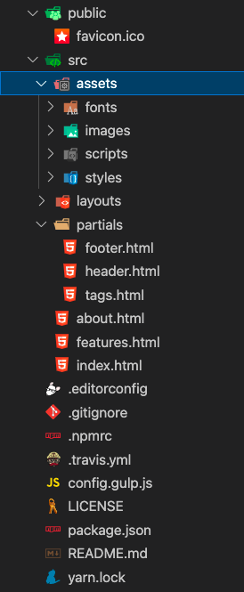
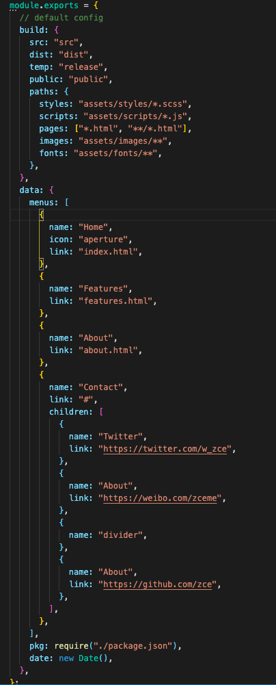

# lhs-pages

一款可以将 普通的 html 项目 自动化打包的工具

## Installation

```shell
$ yarn add lhs-pages

# or npm
$ npm install lhs-pages
```

## useage

安装改工具之后, package.json 中配置可以直接使用命令,

```js
 "scripts": {
    "clean": "lhs-pages clean",
    "develop": "lhs-pages develop",
    "build": "lhs-pages build"
  }
```

默认约定脚手架中有 **config.gulp.js** 文件, 文件中 有 基本配置架构, data 配置.
然后就可以通过命令使用该工具了.

## 备注

#### 脚手架结构



#### config.gulp.js 结构


